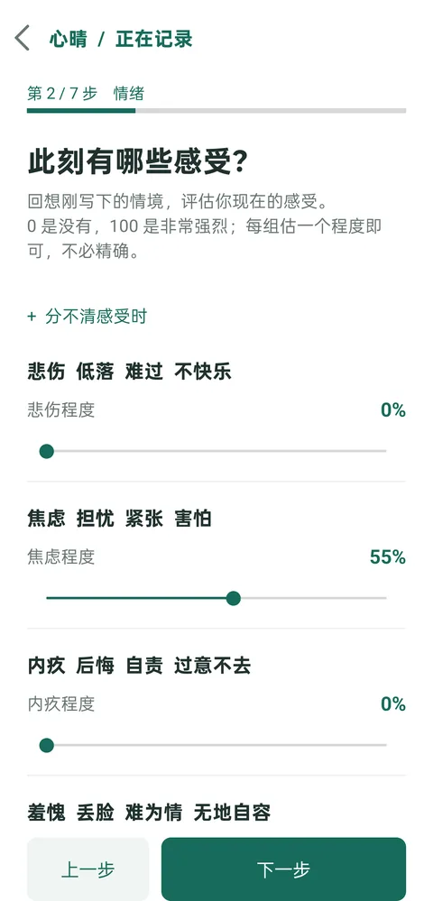
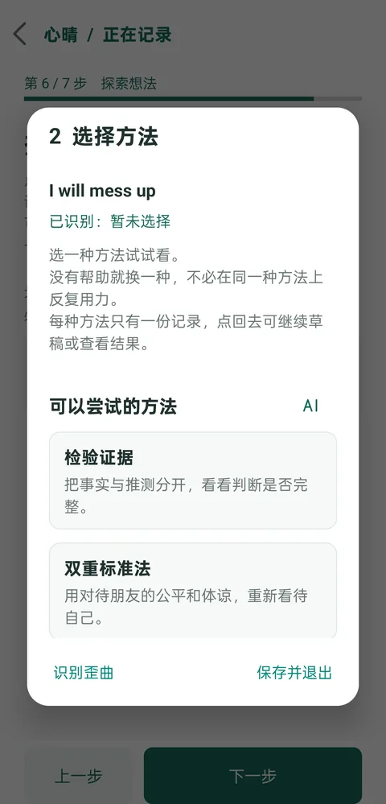
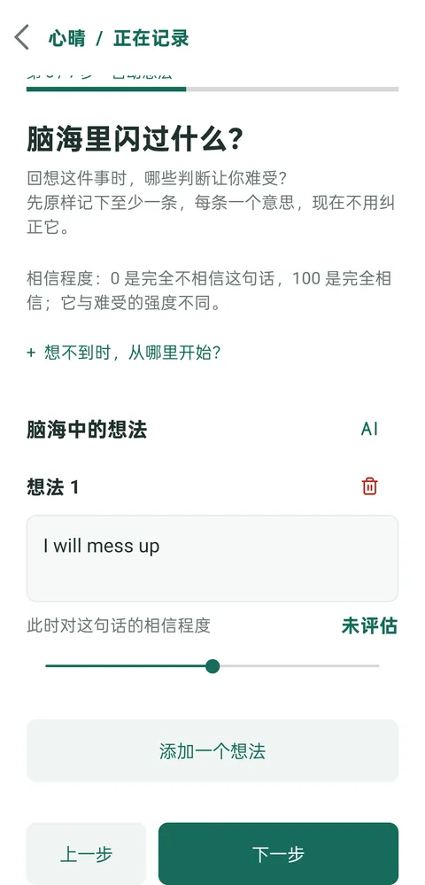

# 心晴 · 情绪日志

跟着《Feeling Great》的思路，写下一个让自己难受的瞬间，理解感受，重新看看脑海里的想法。适用于 Android 8.0 及以上版本。

## 三个特点

1. **完整的记录流程**：依照 David D. Burns《Feeling Great》与 Daily Mood Log 的指引设计，从具体情境、情绪、自动想法，走到正向重构、目标情绪、探索想法和重新评估。一步步完成，也可以保存草稿，稍后继续。
2. **多种应对想法的方法**：目前内置检验证据、双重标准法、灰度思考、语义法、重新归因、定义用词六种方法。可以尝试不同角度，留下对自己有帮助的回应。我们会持续补充，目标是实现书中介绍的全部方法。
3. **按需 AI 辅助**：想不到怎么写时，可以请 AI 帮忙寻找想法、梳理正向重构、识别认知歪曲、推荐方法或补充回应。建议由你决定是否采用；不使用 AI 也能完成整篇日志。AI 功能需要自行配置 DeepSeek API Key。

## 界面预览

| 情绪评分 | 选择方法 | AI 求助入口 |
| :---: | :---: | :---: |
|  |  |  |

## 从源码安装

运行 `bash build.sh` 生成 `build/xinqing.apk`，再运行 `adb install -r build/xinqing.apk` 安装到手机。构建需要 JDK 17、Android SDK Platform 34 和 Build Tools 34.0.0。

每次提交和 Pull Request 都会在 GitHub Actions 构建。运行结束后，可从 **Actions → Build Android APK → Artifacts** 下载 `xinqing-debug-apk`。Actions 使用临时调试签名；不同运行生成的 APK 签名不同，无法直接覆盖安装。已有数据需要保留时，请用同一签名自行构建。

日志保存在设备上，不需要账号。只有主动点击 AI 求助时，相关内容才会发送给 DeepSeek。心晴是独立开发的自助记录工具，并非《Feeling Great》官方产品，也不能替代专业诊断或治疗。
